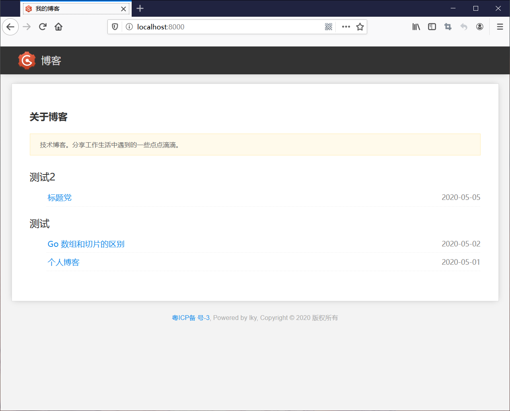
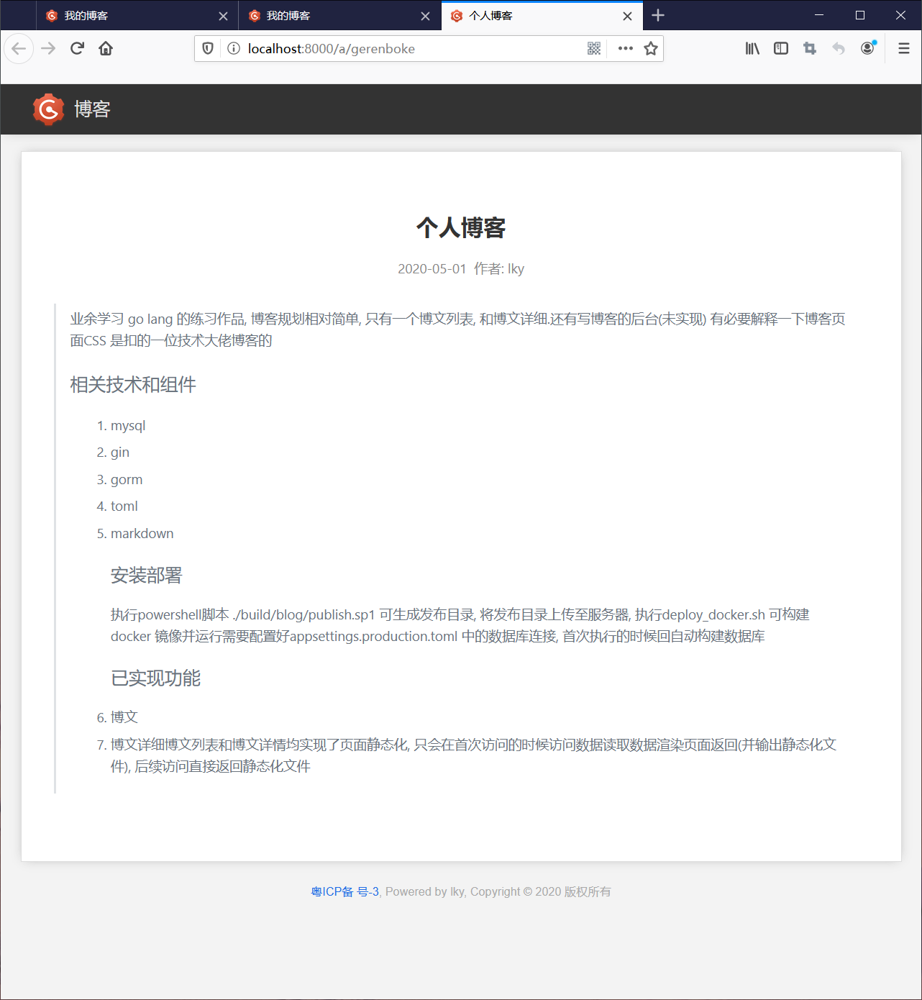

# 个人博客

> 业余学习 go lang 的练习作品, 博客规划相对简单, 只有一个博文列表, 和博文详细.还有写博客的后台(未实现)  

## 相关技术和组件
1. mysql
2. gin
3. gorm
4. toml
5. markdown

## 安装部署
> 执行powershell脚本 ./build/blog/publish.sp1 可生成发布目录,   
> 将发布目录上传至服务器, 执行deploy_docker.sh 可构建docker 镜像并运行  
> 需要配置好appsettings.production.toml 中的数据库连接, 首次执行的时候回自动构建数据库  

## 已实现功能
1. 博文
2. 博文详细

> 博文列表和博文详情均实现了页面静态化, 只会在首次访问的时候访问数据读取数据渲染页面返回(并输出静态化文件), 后续访问直接返回静态化文件

